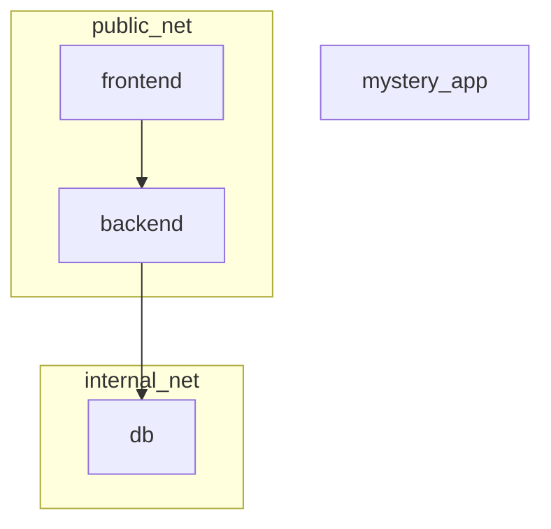

# 🐳 DOCKER NETWORKING LAB – MULTI-STAGE & NETWORKS

---

## 🎯 Objetivos

En este laboratorio deberás:

- Crear imágenes Docker personalizadas usando **multi-stage build**
- Construir un backend en Python con **requirements.txt**
- Construir un frontend con Nginx como reverse proxy
- Utilizar redes Docker definidas por el usuario (`public_net` y `internal_net`)
- Aislar servicios críticos (la base de datos)
- Descargar un contenedor externo y descubrir sus puertos
- Conectar contenedores a múltiples redes dinámicamente

---

## 🏗️ Arquitectura esperada

La aplicación debe estar formada por:

1. **Frontend:** servidor web basado en Nginx  
2. **Backend:** API en Python Flask  
3. **Base de datos:** PostgreSQL oficial  
4. **Contenedor misterioso:** descargado de Docker Hub (nginx:alpine o similar)

---

### 🌐 Redes

- `public_net`: para servicios accesibles desde el host  
- `internal_net`: para comunicación interna entre backend y db  

Condiciones:

- Frontend solo en `public_net`  
- Backend en `public_net` y `internal_net`  
- DB solo en `internal_net`  
- Mystery_app inicialmente no pertenece a ninguna red

---

### 📊 Topología

### 🧩 PARTE 1 — Backend

Debes crear un contenedor que cumpla:
- Base: python:3.11-alpine
- Multi-stage build: un stage de instalación de dependencias y otro de runtime
- Dependencias: Flask (usa requirements.txt)
- Aplicación simple que devuelva un texto al acceder a /
- Escuchar en 0.0.0.0 y puerto 5000
- Exponer el puerto 5000

### 🧩 PARTE 2 — Frontend

Debes crear un contenedor con:
- Base: nginx:alpine
- Configuración personalizada para actuar como reverse proxy hacia el backend
- Proxy debe usar el nombre del servicio para resolver el backend
- Escuchar en el puerto 80 del contenedor
- Copiar la configuración desde un archivo local que tú decidas

### 🧩 PARTE 3 — Base de datos

Debes utilizar la imagen oficial:
- postgres:15

Requisitos:
- Configurar contraseña mediante variable de entorno
- NO debe publicar puertos al host
- Solo debe estar conectada a internal_net

### 🧩 PARTE 4 — docker-compose.yml

Debes:
- Definir los 3 servicios
- Construir las imágenes necesarias
- Asignar correctamente redes
- Publicar únicamente el puerto del frontend
- Crear las redes definidas por usuario

Condiciones obligatorias:
- db no puede ser accesible desde frontend
- backend debe poder comunicarse con db
- frontend debe poder comunicarse con backend

### 🧩 PARTE 5 — Pruebas de conectividad

Debes comprobar:

1. Desde frontend:
- Acceso a backend
- Acceso a db (¿funciona?)

2. Desde backend:
- Acceso a db
- Acceso a frontend

### 🧩 PARTE 6 — Contenedor adicional
Este contenedor no está en docker-compose:
1. Descarga la imagen oficial nginx:alpine desde Docker Hub
2. Sin mirar documentación externa, averigua:
- Qué puerto expone la imagen
- Qué protocolo utiliza
3. Crea un contenedor llamado mystery_app que:
- Esté conectado a public_net
- Publique correctamente el puerto en el host
- Sea accesible desde el navegador

4. BONUS:
- Conecta mystery_app también a internal_net
- Comprueba desde backend que responde

### 🧩 PARTE 7 — Subir registros de contenedores

- Debes subir al menos uno de los contenedores a un repositorio público de tu

### 📌 Entregables

1. Dockerfile backend (multi-stage) y requirements.txt

2. Dockerfile frontend y archivo de configuración Nginx

3. docker-compose.yml

4. Documento con:
  - Comandos usados para crear el contenedor misterioso
  - Capturas todo el proceso (o salida de texto)
